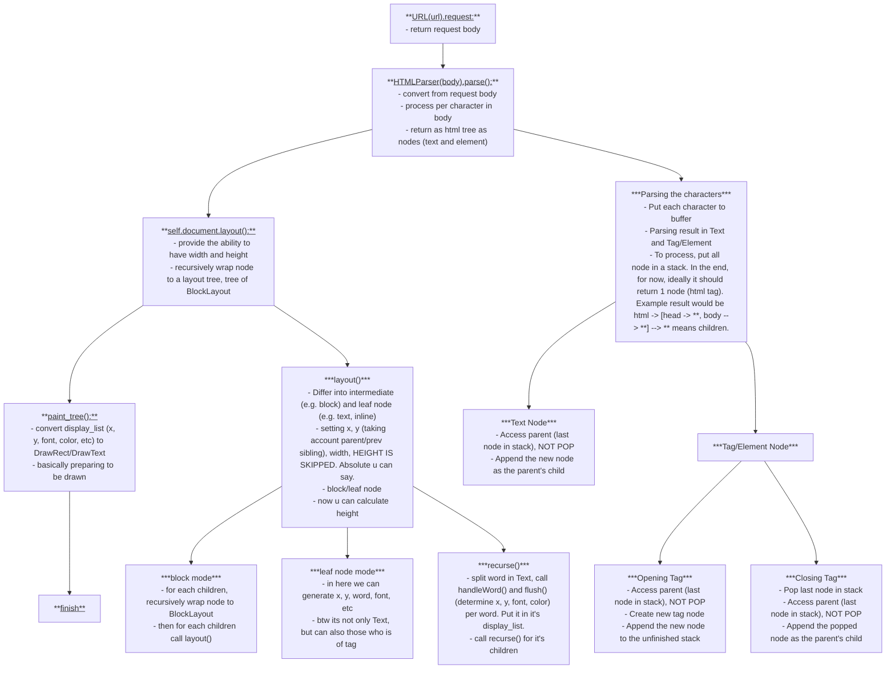
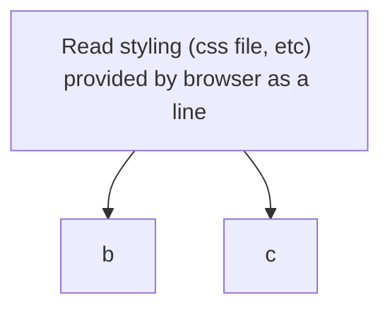

# Diagram Ch 5
## Whole shit

```mermaid
graph TD;
    a["
    **<ins>URL(url).request:</ins>**
    - return request body
    "]-->b;
    b["
    **<ins>HTMLParser(body).parse():</ins>**
    - convert from request body
    - process per character in body
    - return as html tree as nodes (text and element)
    "]-->d;
    b-->b1;
    b1["
    ***Parsing the characters***
    - Put each character to buffer
    - Parsing result in Text and Tag/Element
    - To process, put all node in a stack. In the end, for now, ideally it should return 1 node (html tag). Example result would be html -> [head -> **, body --> **] --> ** means children.
    "]-->b2;
    b1-->b3;
    b2["
    ***Text Node***
    - Access parent (last node in stack), NOT POP
    - Append the new node as the parent's child
    "];
    b3["
    ***Tag/Element Node***
    "]-->b4;
    b3-->b5;
    b4["
    ***Opening Tag***
    - Access parent (last node in stack), NOT POP
    - Create new tag node
    - Append the new node to the unfinished stack
    "];
    b5["
    ***Closing Tag***
    - Pop last node in stack
    - Access parent (last node in stack), NOT POP
    - Append the popped node as the parent's child
    "];
    d["
    **<ins>self.document.layout():**</ins>
    - provide the ability to have width and height
    - recursively wrap node to a layout tree, tree of BlockLayout
    "]-->e;
    d-->d1;
    d1["
    ***layout()***
    - Differ into intermediate (e.g. block) and leaf node (e.g. text, inline)
    - setting x, y (taking account parent/prev sibling), width, HEIGHT IS SKIPPED. Absolute u can say.
    - block/leaf node
    - now u can calculate height
    "]-->d2;
    d1-->d3;
    d1-->d4;
    d2["
    ***block mode***
    - for each children, recursively wrap node to BlockLayout
    - then for each children call layout()
    "];
    d3["
    ***leaf node mode***
    - in here we can generate x, y, word, font, etc
    - btw its not only Text, but can also those who is of tag <title>
    - call recurse() followed by flush()
    "];
    d4["
    ***recurse()***
    - split word in Text, call handleWord() and flush() (determine x, y, font, color) per word. Put it in it's display_list.
    - call recurse() for it's children
    "];
    e["
    **<ins>paint_tree():**</ins>
    - convert display_list (x, y, font, color, etc) to DrawRect/DrawText
    - basically preparing to be drawn
    "]-->finish;
    finish["
    **<ins>finish**</ins>
    "]
```

# Diagram Ch 6
## Parsing style

### Browser styling

```mermaid
graph TD;
    a["
    Read styling (css file, etc) provided by browser as a line
    "]-->b;
    a["
    Read styling (css file, etc) provided by browser as a line
    "]-->c;
```

## Order of processing the body request => get all styles => layouting