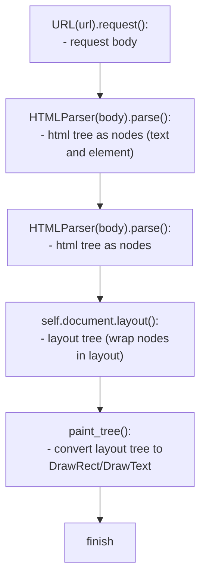

# Diagram Ch 5
## Whole shit

```mermaid
graph TD;
    a["
    URL(url).request():
    - request body
    "]-->b;
    b["
    HTMLParser(body).parse():
    - html tree as nodes (text and element)
    "]-->c;
    c["
    HTMLParser(body).parse():
    - html tree as nodes
    "]-->d;
    d["
    self.document.layout():
    - layout tree (wrap nodes in layout)
    "]-->e;
    e["
    paint_tree():
    - convert layout tree to DrawRect/DrawText
    "]-->finish;
    finish["
    finish
    "]
```

# Diagram Ch 5
## Parsing style all
## Order of processing the body request => get all styles => layouting